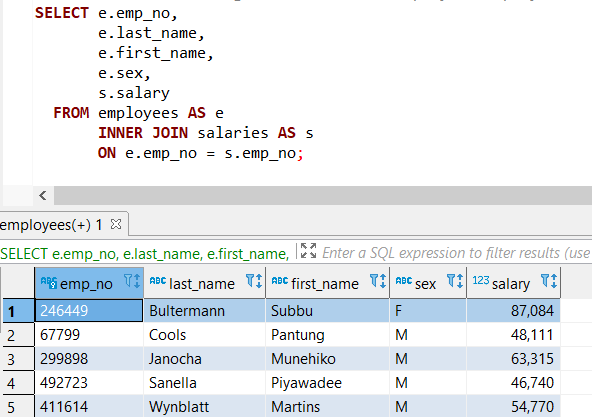

# sql-challenge

UofA Data Analytics Bootcamp Homework Assignment 09-SQL

### Assignment Description
Use a PostgreSQL database to analyze employment records from the 1980s and 1990s stored in six CSV files.

### Folder Descriptions
* assignment_source_files contains the original assignment details posted on the course GitLab site.
* EployeeSQL contains the completed analysis in the sequence that analysis was performed.
    * 0_raw_data: The raw .csv files
    
    * 1_clean_data: I reviewed the clean data for inconsistencies that needed to be corrected. None were found aside from the dept_employees files requiring a composite key due to some employees being assigned to multiple departments.
    
    * 2_SQL-model: I created a visual model of the data contained within the .csv files prior to building a database using the tools provided by [https://app.quickdatabasediagrams.com/#/](https://app.quickdatabasediagrams.com/#/).    Note that minor modifications in field types were implemented in the next analysis step.
    
        
    
    * 3_SQL_DB_Create_Import contains the schema.sql file that creates the necessary tables within the PostgreSQL database. After running schema.sql to create the tables, I used the GUI functionality to import the data from the .csv files.  Due to foreign key requirements, the data needs to be imported in the same order that the tables are created within schema.sql.
    
    * 4_SQL_Analysis contains query.sql which contains the code queries for each of the assignment tasks.
    
    * 5_Bonus_SQLAlchemy contains a Jupyter Notebook analysis of salaries in the database using SQLAlchemy.
    
# Analysis assignments and results
1. List the following details of each employee: employee number, last name, first name, sex, and salary.

2. List first name, last name, and hire date for employees who were hired in 1986.

3. List the manager of each department with the following information: department number, department name, the manager's employee number, last name, first name.

4. List the department of each employee with the following information: employee number, last name, first name, and department name.

5. List first name, last name, and sex for employees whose first name is "Hercules" and last names begin with "B."

6. List all employees in the Sales department, including their employee number, last name, first name, and department name.

7. Original task: List all employees in the Sales **AND** Development departments, including their employee number, last name, first name, and department name.

7. Modified task: List all employees in the Sales **OR** Development departments, including their employee number, last name, first name, and department name.

8. In descending order, list the frequency count of employee last names, i.e., how many employees share each last name.    

# Bonus SQLAlchemy assignments and results
1. Create a histogram to visualize the most common salary ranges for employees.

3.Create a bar chart of average salary by title.

